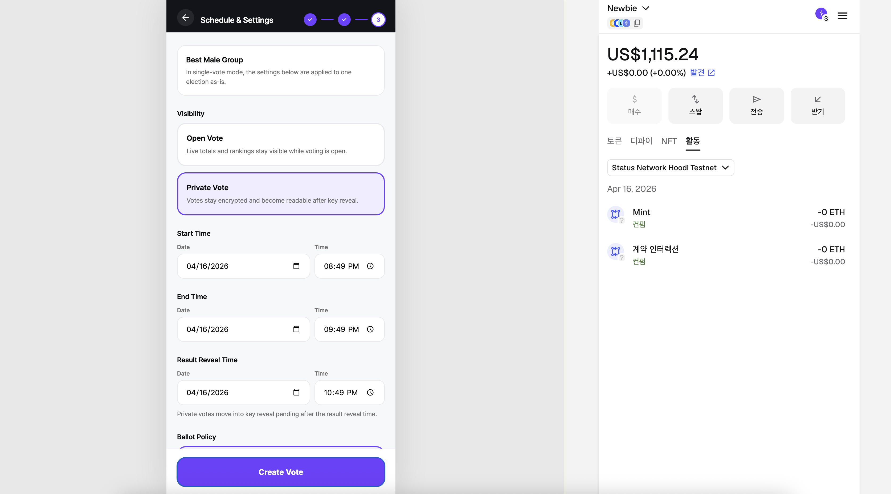
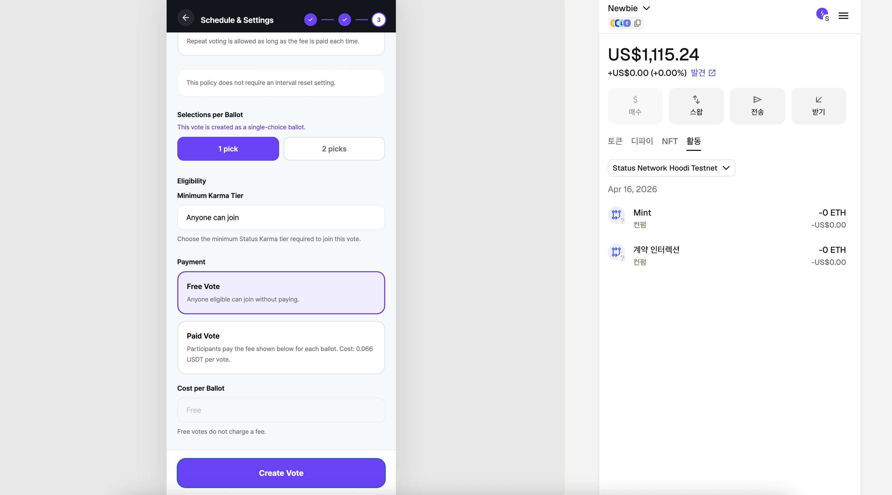
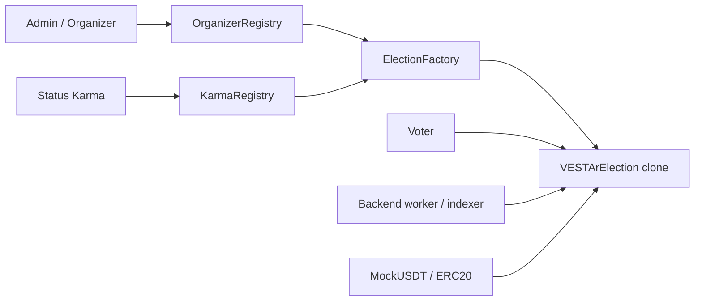
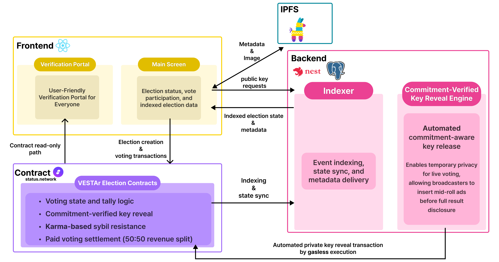
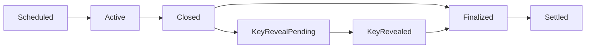

<p align="center">
  
</p>

<p align="center">
  
</p>

# VESTAr Contracts

Smart contracts for VESTAr's organizer gating, clone-based election deployment, open/private voting, and paid settlement on Status Network.

<p align="center">
  <a href="https://github.com/VESTAr-BAY/vestar-frontend">Frontend</a>
  ·
  <a href="https://github.com/VESTAr-BAY/vestar-backend">Backend</a>
  ·
  <a href="https://www.youtube.com/watch?v=QpLsSmcpIjw">Demo Video</a>
  ·
  <a href="https://regal-weather-603.notion.site/Project-Description-3466dc69e5dc8015b7acf9ae8784a01c?pvs=73">Project Description</a>
</p>

## Related Repositories

| Repository | How it connects to this contracts repo |
| --- | --- |
| [`vestar-contracts`](https://github.com/VESTAr-BAY/vestar-contracts) | Core onchain runtime for election creation, voting, reveal, and settlement |
| [`vestar-frontend`](https://github.com/VESTAr-BAY/vestar-frontend) | Host flows, voting UI, and verification portal built on top of these contracts |
| [`vestar-backend`](https://github.com/VESTAr-BAY/vestar-backend) | Indexed read APIs, private vote preparation, and automated key reveal workers |

## Overview

**English**  
This repository contains the onchain core of VESTAr. It is responsible for deciding who can create elections, how votes are accepted, how private voting is revealed, and how paid voting revenue is settled. The design is modular, but the top-level experience is simple: registries gate creation, the factory deploys election clones, and each election handles its own lifecycle.

**한국어**  
이 저장소는 VESTAr의 온체인 핵심 로직을 담고 있습니다. 누가 투표를 생성할 수 있는지, 투표가 어떤 방식으로 제출되는지, 비공개 투표가 언제 공개되는지, 유료 투표 수익이 어떻게 정산되는지를 이 저장소가 결정합니다. 구조는 모듈형이지만 흐름은 단순합니다. 레지스트리가 생성 자격을 판단하고, 팩토리가 election clone을 배포하며, 각 election 인스턴스가 자신의 생명주기를 직접 관리하는 방식입니다.

## Key Features

**English**

- Organizer verification and creation gating through onchain registries.
- Clone-based election deployment for consistent runtime behavior.
- Support for both open voting and private encrypted voting.
- Commitment-verified private key reveal for verifiable private results.
- Paid voting settlement with an ERC20-based revenue split.

**한국어**

- 온체인 레지스트리를 통한 주최자 검증과 생성 자격 관리 구조입니다.
- 일관된 동작을 위한 clone 기반 election 배포 구조입니다.
- 공개 투표와 비공개 암호화 투표를 모두 지원합니다.
- 비공개 결과 검증을 위한 commitment-verified key reveal 구조입니다.
- ERC20 기반 수익 분배를 포함한 유료 투표 정산 구조입니다.

<p align="center">
  
  
  
</p>

## Architecture

**English**  
At a high level, VESTAr contracts are organized around three layers: registries, factory, and election instances. Registries provide organizer and karma context, the factory enforces creation rules and deploys clones, and each deployed election handles voting, reveal, finalization, and settlement.

**한국어**  
큰 흐름에서 VESTAr 컨트랙트는 레지스트리, 팩토리, election 인스턴스의 세 층으로 구성되어 있습니다. 레지스트리는 주최자와 카르마 정보를 제공하고, 팩토리는 생성 규칙을 검증한 뒤 clone을 배포하며, 실제 election 인스턴스는 투표, 공개, 최종 확정, 정산을 담당합니다.



<p align="center">
  
</p>

## Contract Suite

| Contract | Role |
| --- | --- |
| `VESTArOrganizerRegistry` | Stores organizer profile data and verification state |
| `VESTArKarmaRegistry` | Reads Status Karma and KarmaTiers for eligibility checks |
| `VESTArElectionFactory` | Validates organizer eligibility and deploys election clones |
| `VESTArElection` | Per-election runtime covering lifecycle, voting, reveal, and settlement |
| `MockUSDT` | 6-decimal ERC20 used for paid vote flows on testnet |

**English**  
If you want implementation-level detail, the internal contract map is documented in [`src/vestar/README.md`](./src/vestar/README.md).

**한국어**  
구현 단위의 더 자세한 구조가 필요하면 [`src/vestar/README.md`](./src/vestar/README.md)에서 내부 폴더와 모듈 구성을 확인할 수 있습니다.

## Election Lifecycle

**English**  
Open and private elections share the same broad lifecycle, but private elections add a reveal step before finalization. That reveal step is what allows temporary privacy during voting and verifiability afterward.

**한국어**  
공개 투표와 비공개 투표는 큰 생명주기를 공유하지만, 비공개 투표는 최종 확정 전에 key reveal 단계가 한 번 더 들어갑니다. 이 단계 덕분에 진행 중에는 프라이버시를 유지하고, 종료 후에는 결과를 다시 검증할 수 있습니다.



## On-Chain Rules

**English**

- `startAt < endAt` and `resultRevealAt >= endAt` are validated onchain.
- `FREE` elections require zero cost, while `PAID` elections require a token and a positive price.
- `PRIVATE` elections require a public key, a commitment hash, and `keySchemeVersion == 1`.
- `ONE_PER_INTERVAL` requires a positive reset interval.
- `UNLIMITED_PAID` is single-choice only and currently enforces `costPerBallot == 66_000`.
- `finalizeResults(...)` requires the correct terminal state before execution.

**한국어**

- `startAt < endAt`, `resultRevealAt >= endAt` 규칙을 온체인에서 검증합니다.
- `FREE` election은 비용이 0이어야 하고, `PAID` election은 토큰 주소와 양수 가격이 필요합니다.
- `PRIVATE` election은 공개키, 커밋 해시, `keySchemeVersion == 1` 조건이 필요합니다.
- `ONE_PER_INTERVAL`은 양수 reset interval이 필요합니다.
- `UNLIMITED_PAID`는 단일 선택만 허용하며 현재 `costPerBallot == 66_000`을 강제합니다.
- `finalizeResults(...)`는 올바른 종료 상태에 도달한 뒤에만 실행할 수 있습니다.

## Repository Layout

```text
contracts/
├─ abi/                    # ABI handoff artifacts and deployment address snapshots
├─ script/                 # Foundry deployment and sync scripts
├─ src/
│  ├─ config/              # Network-specific constants
│  ├─ interfaces/          # Public interfaces
│  ├─ mocks/               # MockUSDT and test helpers
│  └─ vestar/              # Registries, factory, and election runtime
├─ test/                   # Foundry test suite
└─ foundry.toml
```

## Quick Start

### Build

```bash
forge build
```

### Test

```bash
forge test
```

### Deploy the Full Stack

```bash
forge script script/DeployVESTArStack.s.sol:DeployVESTArStackScript \
  --rpc-url status_hoodi \
  --broadcast \
  --gas-price 0 \
  --priority-gas-price 0
```

### Deploy MockUSDT Only

```bash
forge script script/DeployMockUSDT.s.sol:DeployMockUSDTScript \
  --rpc-url status_hoodi \
  --broadcast \
  --gas-price 0 \
  --priority-gas-price 0
```

### Refresh ABI Artifacts

```bash
./script/SyncStatusArtifacts.sh
```

## Network Defaults

| Item | Value |
| --- | --- |
| Network | `Status Network Hoodi Testnet` |
| Chain ID | `374` |
| RPC | `https://public.hoodi.rpc.status.network` |
| EVM Version | `paris` |
| Solidity | `0.8.24` |
| Status Karma | `0x0700be6f329cc48c38144f71c898b72795db6c1b` |
| Status KarmaTiers | `0xb8039632e089dcefa6bbb1590948926b2463b691` |
| Multicall3 | `0xcA11bde05977b3631167028862bE2a173976CA11` |

## Development Notes

**English**  
The current Foundry profile uses Solidity `0.8.24`, `evm_version = "paris"`, and optimizer settings tuned for deployment size. This matters because the assembled election runtime can become large without those defaults.

**한국어**  
현재 Foundry 설정은 Solidity `0.8.24`, `evm_version = "paris"`, optimizer 활성화를 기준으로 맞춰져 있습니다. 이는 election 런타임이 여러 기능을 조합하는 구조이기 때문에, 이 기본값이 맞지 않으면 배포 크기 제한에 걸릴 수 있기 때문입니다.

## Notice

**English**  
If gasless deployment is temporarily unavailable on Status Hoodi, deployment may require explicit gas settings instead of the expected zero-gas flow.

**한국어**  
Status Hoodi에서 가스리스 배포가 일시적으로 동작하지 않는 경우에는, 기대했던 zero-gas 흐름 대신 명시적인 gas 설정으로 배포해야 할 수 있습니다.
