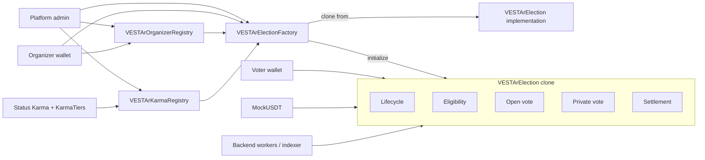
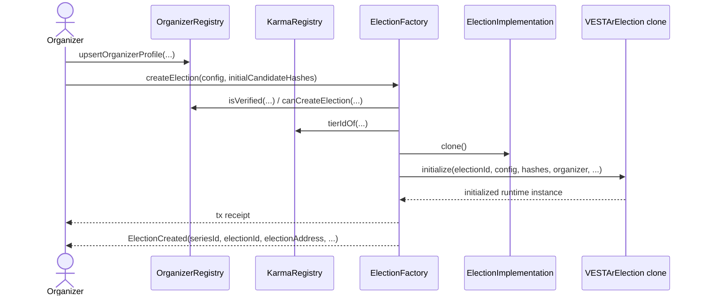
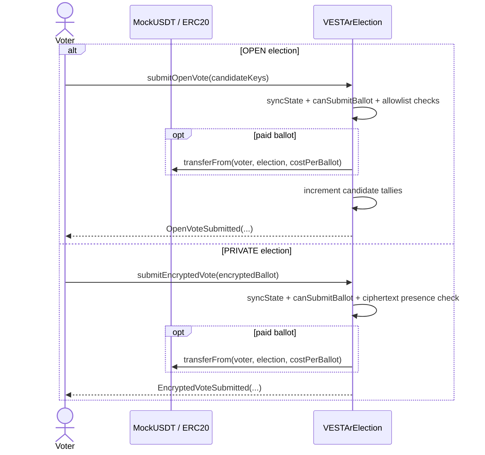
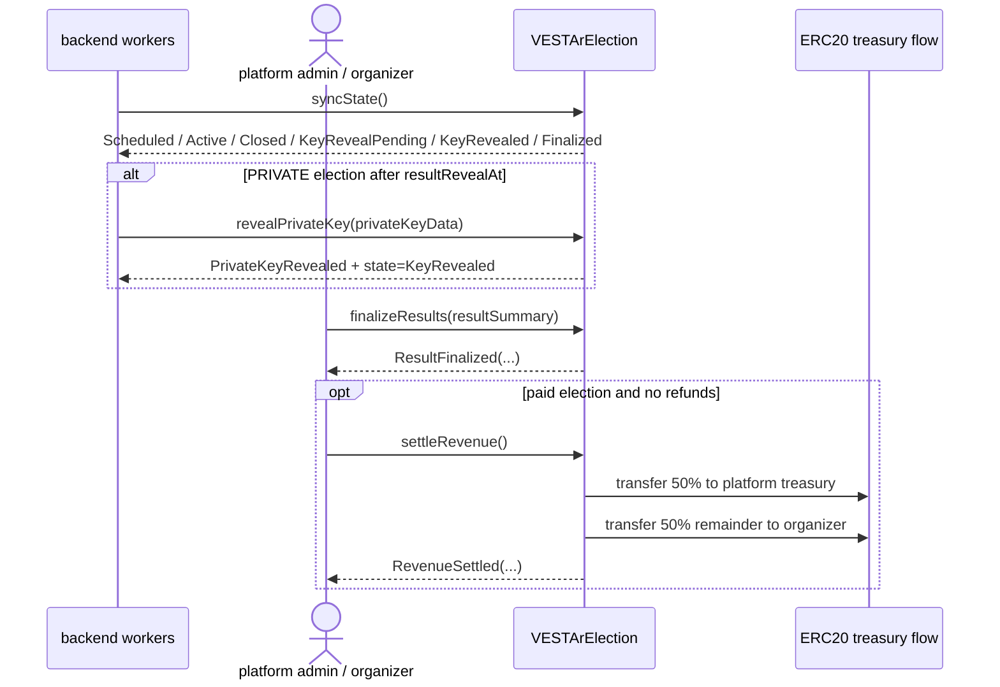
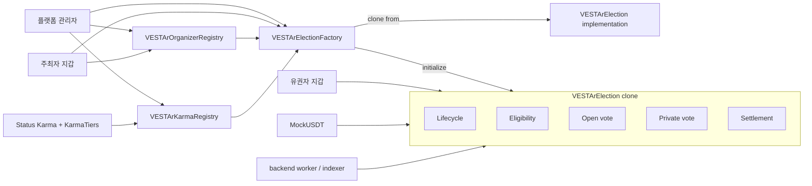
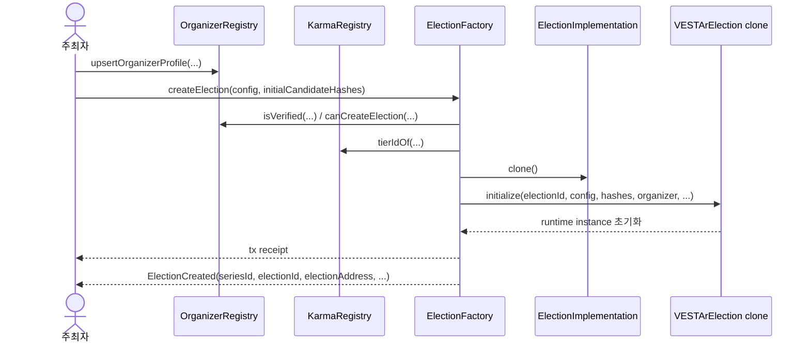
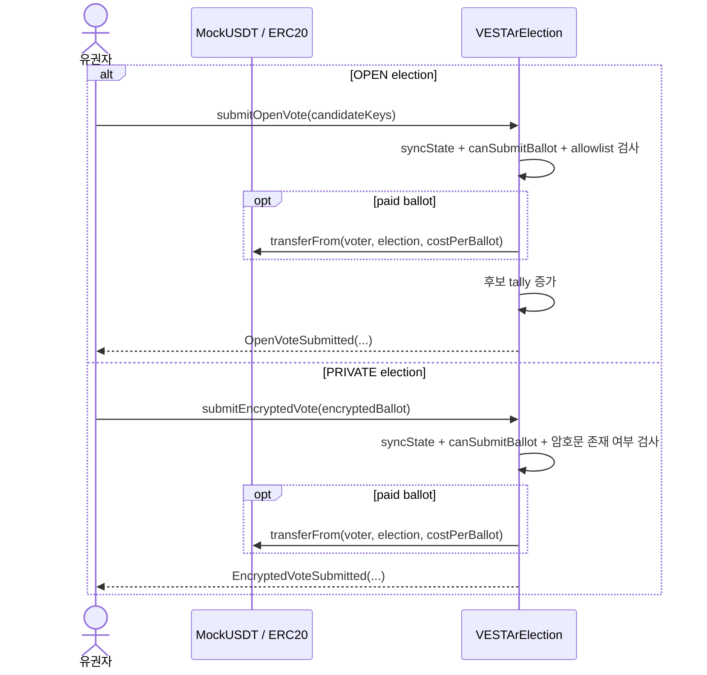
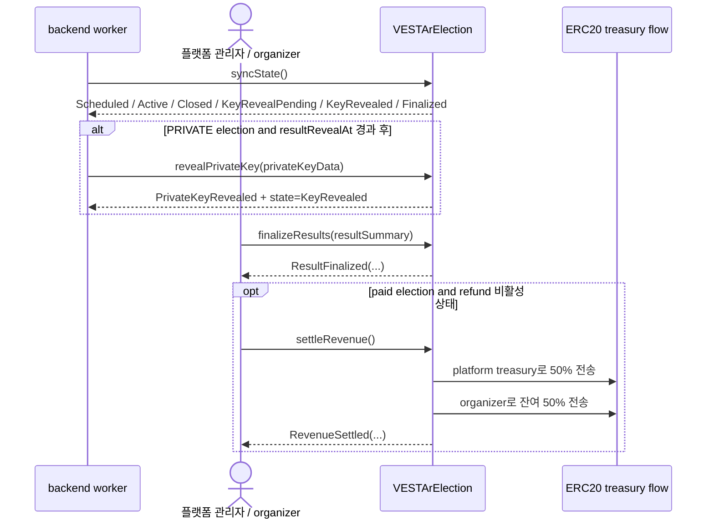

# VESTAr Contracts

Smart-contract stack for organizer gating, clone-based election deployment, open/private voting, and settlement on Status Network Testnet.

## English

### Overview

This repository contains the current VESTAr on-chain runtime used by the frontend and backend.

- `VESTArOrganizerRegistry` stores organizer profile data and verification state.
- `VESTArKarmaRegistry` reads Status `Karma` and `KarmaTiers` and translates eligibility.
- `VESTArElectionFactory` validates organizer eligibility and deploys election clones.
- `VESTArElection` is the per-election runtime assembled from lifecycle, eligibility, open vote, private vote, and settlement modules.
- `MockUSDT` is the 6-decimal ERC20 used for paid-vote flows on testnet.

### Contract Topology



### Runtime Modules

| Module | Responsibility |
| --- | --- |
| `Lifecycle` | State calculation, `syncState`, cancel, close, key reveal, finalize |
| `Eligibility` | Karma checks, ballot-period rules, remaining ballot calculation |
| `Open vote` | Plaintext candidate submission, duplicate detection, candidate allowlist, live on-chain tallies |
| `Private vote` | Ciphertext submission, public key getters, commitment-based reveal path |
| `Settlement` | ERC20 collection, 50:50 revenue split, refunds |
| `Factory` | Organizer eligibility checks, clone deployment, canonical `ElectionCreated` event |

### Sequence: Organizer Eligibility And Election Creation



### Sequence: Ballot Submission



### Sequence: Lifecycle, Reveal, Finalize, Settlement



### On-Chain Rules Checked In Code

- `seriesId` must be non-zero and the initial candidate hash list must be non-empty.
- `startAt < endAt` and `resultRevealAt >= endAt` are enforced in config validation.
- `FREE` elections must use zero cost. `PAID` elections must set a token address and positive price.
- `PRIVATE` elections must set a public key, a private-key commitment hash, and `keySchemeVersion == 1`.
- `ONE_PER_INTERVAL` requires a positive `resetInterval`.
- `UNLIMITED_PAID` is single-choice only and currently hard-checks `costPerBallot == 66_000`.
- Verified organizers can create elections with karma tier `0`. Unverified organizers need tier `>= 1`.
- Open ballots reject duplicate candidate selections on-chain.
- `revealPrivateKey(bytes)` is restricted to the platform admin or delegated reveal managers.
- `finalizeResults(...)` requires `Closed` for `OPEN` elections and `KeyRevealed` for `PRIVATE` elections.
- Revenue splits 50:50, with odd remainder flowing to the organizer.

### Repository Map

```text
contracts/
├─ abi/
│  ├─ VESTArElection.json
│  ├─ VESTArElectionFactory.json
│  ├─ VESTArOrganizerRegistry.json
│  ├─ VESTArKarmaRegistry.json
│  ├─ MockUSDT.json
│  └─ status-testnet.addresses.json
├─ script/
│  ├─ DeployMockUSDT.s.sol
│  ├─ DeployVESTArFactoryOnly.s.sol
│  ├─ DeployVESTArStack.s.sol
│  └─ SyncStatusArtifacts.sh
├─ src/
│  ├─ access/
│  ├─ config/
│  ├─ interfaces/vestar/
│  ├─ libraries/vestar/VESTArTypes.sol
│  ├─ mocks/MockUSDT.sol
│  └─ vestar/
│     ├─ registry/
│     ├─ factory/
│     └─ election/
└─ test/
```

### Status Testnet Deployment

| Item | Value |
| --- | --- |
| Network | `Status Network Testnet` |
| Chain ID | `1660990954` |
| RPC | `https://public.sepolia.rpc.status.network` |
| EVM | `paris` |
| OrganizerRegistry | `0x31891950a0B5b289fFdA7478DeaE3CED0FB4c4D5` |
| KarmaRegistry | `0x09F78697C55C318eABb532f65c03b5E4a5222429` |
| ElectionImplementation | `0x2604Fe2ae34D4292FE50418303C18aA5bD32Ba83` |
| VESTArElectionFactory | `0x4173b26b14748fe6342b2c444334095ecB7f0854` |
| MockUSDT | `0x0cf5032E38C729744953dC44EB0F0e3cC6F21855` |

### Development

Build:

```bash
forge build
```

Test:

```bash
forge test
```

Deploy the full stack:

```bash
forge script script/DeployVESTArStack.s.sol:DeployVESTArStackScript \
  --rpc-url status_testnet \
  --broadcast \
  --gas-price 0 \
  --priority-gas-price 0
```

Deploy `MockUSDT` only:

```bash
forge script script/DeployMockUSDT.s.sol:DeployMockUSDTScript \
  --rpc-url status_testnet \
  --broadcast \
  --gas-price 0 \
  --priority-gas-price 0
```

Refresh ABI handoff artifacts:

```bash
./script/SyncStatusArtifacts.sh
```

## 한국어

### 개요

이 저장소는 현재 VESTAr 프론트엔드와 백엔드가 사용하는 온체인 런타임을 담는다.

- `VESTArOrganizerRegistry`는 organizer profile과 verification 상태를 저장한다.
- `VESTArKarmaRegistry`는 Status `Karma`, `KarmaTiers`를 읽어 자격 판정을 해석한다.
- `VESTArElectionFactory`는 organizer 생성 자격을 검증하고 election clone을 배포한다.
- `VESTArElection`은 lifecycle, eligibility, open vote, private vote, settlement 모듈을 조합한 개별 election 런타임이다.
- `MockUSDT`는 테스트넷 유료 투표 플로우에 쓰는 6-decimal ERC20이다.

### 컨트랙트 토폴로지



### 런타임 모듈

| 모듈 | 책임 |
| --- | --- |
| `Lifecycle` | 상태 계산, `syncState`, cancel, close, key reveal, finalize |
| `Eligibility` | karma 검사, ballot period 규칙, 남은 ballot 계산 |
| `Open vote` | 평문 후보 제출, 중복 선택 차단, 후보 allowlist, 온체인 실시간 tally |
| `Private vote` | 암호문 제출, 공개키 getter, commitment 기반 reveal 경로 |
| `Settlement` | ERC20 수납, 50:50 정산, refund |
| `Factory` | organizer 자격 검증, clone 배포, 정식 `ElectionCreated` 이벤트 발행 |

### 시퀀스: organizer 자격 검증과 election 생성



### 시퀀스: ballot 제출



### 시퀀스: lifecycle, reveal, finalize, settlement



### 코드상 강제 규칙

- `seriesId`는 0일 수 없다. 초기 candidate hash 목록은 비어 있을 수 없다.
- config 검증에서 `startAt < endAt`, `resultRevealAt >= endAt`를 강제한다.
- `FREE` election은 비용이 0이어야 한다. `PAID` election은 토큰 주소와 양수 가격이 필요하다.
- `PRIVATE` election은 공개키, private-key commitment hash, `keySchemeVersion == 1`을 반드시 설정해야 한다.
- `ONE_PER_INTERVAL`은 양수 `resetInterval`이 필요하다.
- `UNLIMITED_PAID`는 단일 선택만 허용하고 현재 `costPerBallot == 66_000`을 강제한다.
- verified organizer는 karma tier `0`이어도 생성 가능하다. unverified organizer는 tier `1` 이상이 필요하다.
- open ballot은 온체인에서 중복 후보 선택을 거절한다.
- `revealPrivateKey(bytes)`는 플랫폼 관리자 또는 위임된 reveal manager만 호출 가능하다.
- `finalizeResults(...)`는 `OPEN` election에서 `Closed`, `PRIVATE` election에서 `KeyRevealed` 상태를 요구한다.
- 수익은 50:50으로 분배하며, 홀수 잔차는 organizer에게 귀속한다.

### 저장소 맵

```text
contracts/
├─ abi/
│  ├─ VESTArElection.json
│  ├─ VESTArElectionFactory.json
│  ├─ VESTArOrganizerRegistry.json
│  ├─ VESTArKarmaRegistry.json
│  ├─ MockUSDT.json
│  └─ status-testnet.addresses.json
├─ script/
│  ├─ DeployMockUSDT.s.sol
│  ├─ DeployVESTArFactoryOnly.s.sol
│  ├─ DeployVESTArStack.s.sol
│  └─ SyncStatusArtifacts.sh
├─ src/
│  ├─ access/
│  ├─ config/
│  ├─ interfaces/vestar/
│  ├─ libraries/vestar/VESTArTypes.sol
│  ├─ mocks/MockUSDT.sol
│  └─ vestar/
│     ├─ registry/
│     ├─ factory/
│     └─ election/
└─ test/
```

### Status Testnet 배포 정보

| 항목 | 값 |
| --- | --- |
| 네트워크 | `Status Network Testnet` |
| 체인 ID | `1660990954` |
| RPC | `https://public.sepolia.rpc.status.network` |
| EVM | `paris` |
| OrganizerRegistry | `0x31891950a0B5b289fFdA7478DeaE3CED0FB4c4D5` |
| KarmaRegistry | `0x09F78697C55C318eABb532f65c03b5E4a5222429` |
| ElectionImplementation | `0x2604Fe2ae34D4292FE50418303C18aA5bD32Ba83` |
| VESTArElectionFactory | `0x4173b26b14748fe6342b2c444334095ecB7f0854` |
| MockUSDT | `0x0cf5032E38C729744953dC44EB0F0e3cC6F21855` |

### 개발

빌드:

```bash
forge build
```

테스트:

```bash
forge test
```

전체 스택 배포:

```bash
forge script script/DeployVESTArStack.s.sol:DeployVESTArStackScript \
  --rpc-url status_testnet \
  --broadcast \
  --gas-price 0 \
  --priority-gas-price 0
```

`MockUSDT`만 배포:

```bash
forge script script/DeployMockUSDT.s.sol:DeployMockUSDTScript \
  --rpc-url status_testnet \
  --broadcast \
  --gas-price 0 \
  --priority-gas-price 0
```

ABI handoff 산출물 갱신:

```bash
./script/SyncStatusArtifacts.sh
```
